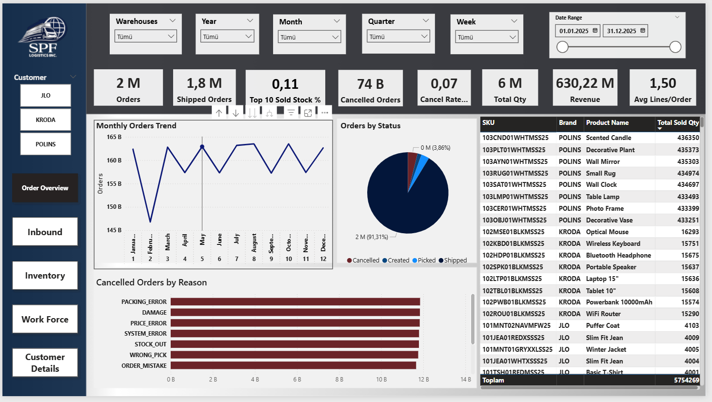
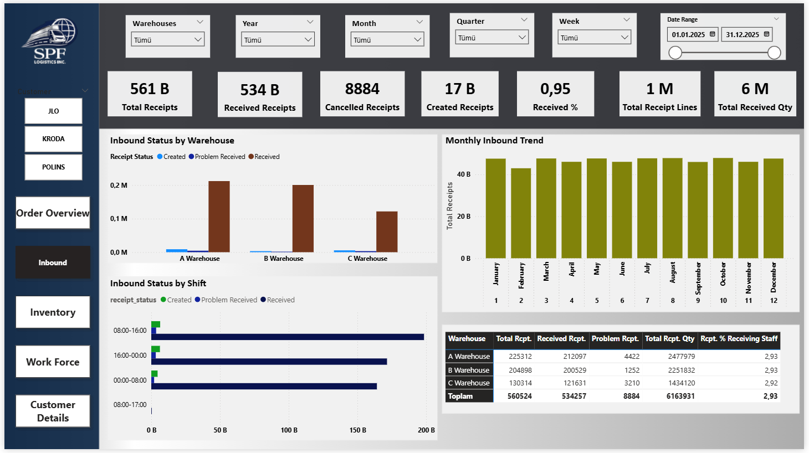
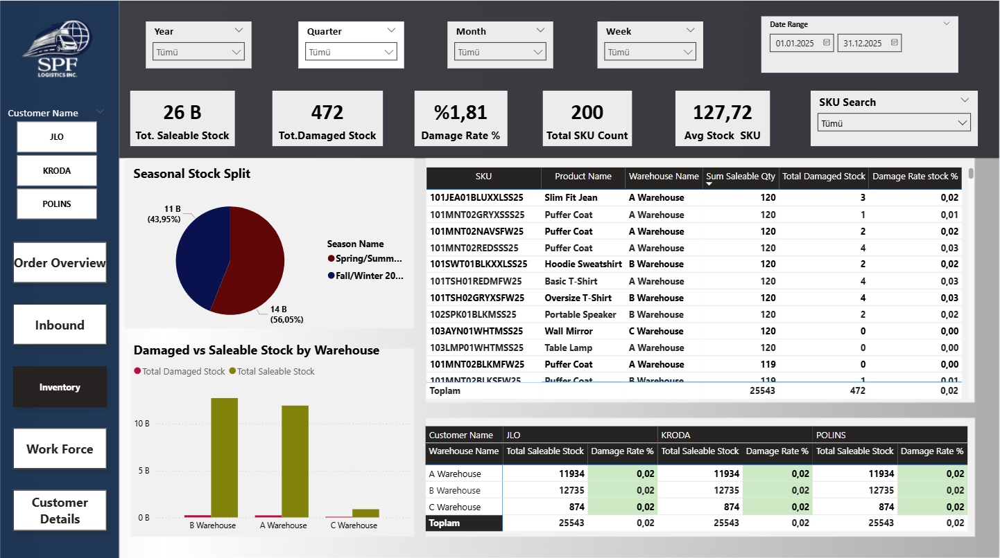
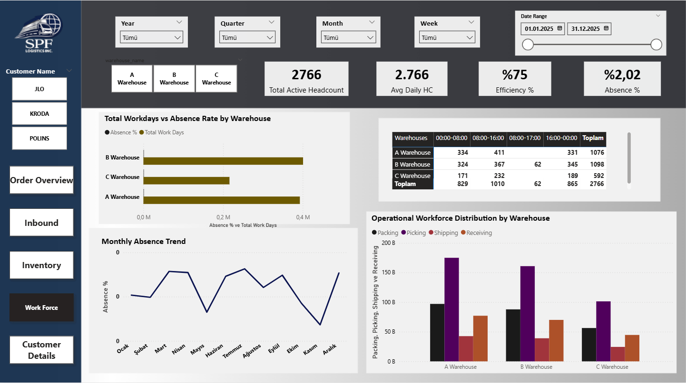
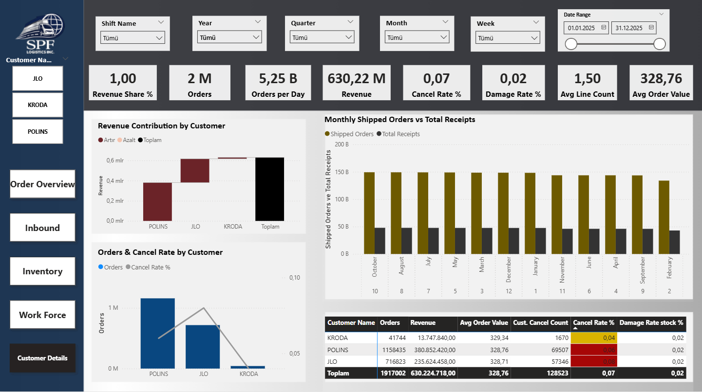

## Dashboard Report Introduction

This report presents the analytical structure of the SPF Logistics Control dashboard, developed using PostgreSQL and Power BI. 
The project was designed to simulate a logistics operation and transform raw operational data into meaningful performance indicators. 
The dashboard is organized into multiple pages, each focusing on a different operational area such as order management, inbound processes, inventory, workforce, and customer performance.
The purpose of this report is to explain the logic, KPIs, and business value behind each dashboard page.

## Order Overview

The Order Overview page provides a view of outbound order performance. It highlights key KPIs such as total orders, shipped orders, revenue, cancel rate, and average order value.

Visuals on this page show monthly order trends, order status distribution, cancellation reasons, and top-selling SKUs. This helps quickly understand order volume, product demand, and potential operational issues affecting order fulfillment.

## Inbound

The Inbound page focuses on warehouse receiving operations. It tracks key metrics such as total receipts, received receipts, problem receipts, and total received quantity.

The visuals show inbound performance by warehouse and shift, along with monthly receiving trends. This page helps evaluate receiving efficiency, detect operational bottlenecks, and monitor inbound workload distribution across warehouses.

## Inventory

The Inventory page focuses on stock availability and quality across warehouses. It tracks key metrics such as total saleable stock, damaged stock, damage rate, total SKU count, and average stock per SKU.

The visuals show seasonal stock distribution and compare damaged versus saleable stock by warehouse. This page helps monitor inventory health, identify stock quality issues, and evaluate how inventory is distributed across warehouses and products.

## Workforce

The Workforce page analyzes labor performance and workforce distribution across warehouses. It tracks key indicators such as total active headcount, average daily headcount, efficiency rate, and absence rate.

The visuals highlight workforce allocation by operational activity (packing, picking, shipping, receiving), shift distribution, and monthly absence trends. This page helps evaluate labor utilization, workforce efficiency, and staffing balance across warehouse operations.

## Customer Details

The Customer Details page analyzes customer performance and revenue contribution. It highlights key metrics such as total orders, revenue, average order value, cancel rate, and damage rate by customer.

The visuals show how each customer contributes to total revenue and order volume, along with cancellation behavior and order trends. This page helps evaluate customer importance, identify high-value clients, and monitor service performance across different customers.

