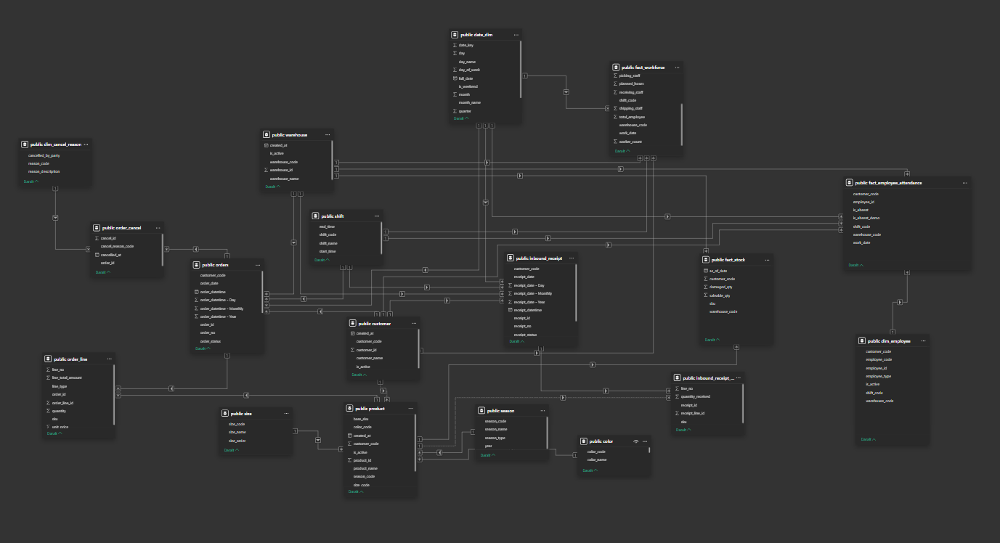

# SPF Logistics Control – Power BI & PostgreSQL Analytics Project

## Project Overview
SPF Logistics Control is a logistics analytics project designed to analyze warehouse operations using a PostgreSQL database and Power BI dashboards.

The project simulates a logistics environment including orders, inbound operations, inventory management, workforce metrics, and customer performance analysis.

A dummy logistics dataset was created in PostgreSQL, and the data model was connected to Power BI to build an operational performance dashboard.

link Project : "https://drive.google.com/file/d/1l1dFS7gelKipUUdNx8ut72XwsFag9FCL/view?usp=sharing"
---

## Technologies Used

- PostgreSQL – Database creation and data modeling
- SQL – Table creation, relationships and queries
- Power BI – Data modeling and visualization
- DAX – KPI calculations and performance metrics
- GitHub – Version control and project documentation

---

## ER Diagram

This ER diagram illustrates the relational structure of the SPF Logistics database, including tables, attributes, and their relationships.

## Database Structure

The PostgreSQL database includes tables that simulate logistics operations such as:

- Orders
- Order Lines
- Customers
- Warehouses
- Products
- Inventory
- Workforce
- Receipts (Inbound)

The database was designed to support warehouse operational analytics.

---

## Dashboard Pages

The Power BI report includes the following analytics sections:

### Order Overview
- Total Orders
- Shipped Orders
- Cancelled Orders
- Revenue
- Average Order Lines
- Monthly Order Trends
- Order Status Distribution

### Inbound Operations
- Total Receipts
- Received Receipts
- Problem Receipts
- Monthly Inbound Trend
- Inbound Performance by Warehouse
- Inbound Performance by Shift

### Inventory Analysis
- Total Saleable Stock
- Damaged Stock
- Damage Rate
- SKU Count
- Seasonal Stock Distribution
- Warehouse Stock Comparison

### Workforce Performance
- Total Active Headcount
- Average Daily Headcount
- Efficiency Rate
- Absence Rate
- Workforce Distribution by Operation

### Customer Performance
- Revenue Contribution by Customer
- Orders by Customer
- Cancel Rate by Customer
- Average Order Value
- Customer Performance Comparison

---

## Key KPIs

Some of the KPIs included in the dashboard:

- Order Volume
- Revenue
- Cancel Rate
- Damage Rate
- Average Order Value
- Workforce Efficiency
- Absence Rate
- Inventory Levels

---

## Project Purpose

The goal of this project is to demonstrate how logistics operational data can be modeled and analyzed using SQL and Power BI.

It showcases the ability to:

- Design a relational database
- Connect PostgreSQL to Power BI
- Build operational dashboards
- Create logistics performance KPIs

 
